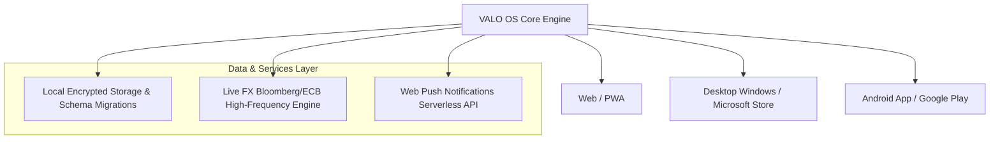

<div align="center">

# 💎 VALO OS — Intelligent Financial Operating System

**Next-Generation Personal Finance & Real-Time Multi-Currency Expense Management Platform**

[](https://aurora-finanzix.vercel.app/)
[](https://apps.microsoft.com/)
[](https://play.google.com/store)
[](#license)

</div>

---

## 🌟 Overview

**VALO OS** (formerly *Aurora Finanzix*) is a luxury, privacy-first personal finance operating system engineered for real-time liquidity tracking, multi-currency conversions with Bloomberg/ECB spot rates, loan amortization calculations, and automated recurring subscription monitoring across Web, Desktop, and Android.

---

## 🚀 Key Features

* **💎 Obsidian & Pearl UI:** Luxury fintech aesthetic with tactile liquid glass, obsidian living video cards, and 120 FPS spring physics.
* **📈 Real-Time Multi-Currency FX Engine:** High-frequency spot conversions with Bloomberg & European Central Bank market parity across 11+ global currencies (`USD`, `PEN`, `EUR`, `GBP`, `BRL`, `MXN`, `CLP`, etc.) with failover resilience and 1-tap live refresh.
* **📱 Floating Edge Utility Drawer:** Global slide-out edge drawer featuring instant tactile calculator and live currency converter.
* **📊 Dynamic Liquidity Spline:** High-resolution dynamic mathematical spline curve visualizing weekly cashflow and cash burn velocity.
* **🎯 Monthly Budget Control & Pace Radar:** Interactive spending limits with daily safe-to-spend pace indicators.
* **📅 Multi-Country Recurring Services & Bills Radar:** Searchable catalog with official brand logos for utility, streaming, and telecoms services.
* **🔐 Hardware-Accelerated Biometrics & PIN Lock:** Obsidian security screen with physical lock opening animation, WebAuthn biometrics, and PWA titlebar synchronization.
* **🌐 Universal Cross-Platform:** Seamlessly runs on modern Web browsers, installable PWA with Window Controls Overlay, Microsoft Store, and Android APK/AAB via Capacitor.

---

## 🏗️ Architecture



---

## 🛠️ Technology Stack

* **Frontend:** Vanilla JavaScript (ES Modules), Vite 6, CSS3 Modern Tokens, Lucide Icons, Canvas Confetti, Chart.js.
* **Mobile Runtime:** Capacitor 8.5, Android SDK 35 (Android 15), Gradle 8.x.
* **APIs & Edge:** Vercel Serverless Functions (`/api/push-subscribe`, `/api/push-send`), Web Push VAPID Protocol.
* **Localization:** 100% Bilingual (`es-PE` / `en-US`), Auto-Geo Detection with silent fallback.

---

## 🚀 Quick Start

### Prerequisites
* Node.js `>= 18.0.0`
* npm `>= 9.0.0`

### Installation & Local Development

```bash
# 1. Clone repository
git clone https://github.com/JulioHVPalacios/aurora-finanzix.git
cd aurora-finanzix

# 2. Install dependencies
npm install

# 3. Start local development server
npm run dev

# 4. Build for production
npm run build
```

### Android Build & Sync

```bash
# Sync web build to native Android project
npx cap sync android

# Open in Android Studio
npx cap open android
```

---

## 🔒 Security & Best Practices

* **No Hardcoded Secrets:** Signing keystores and API private keys are managed strictly via environment variables or local `keystore.properties` (excluded from Git).
* **Privacy-First:** User financial data is retained exclusively on-device without telemetry leakage.
* See [SECURITY.md](SECURITY.md) for vulnerability disclosure policies.

---

## 📄 License

Distributed under the MIT License. Developed by **Vexor Systems** (Julio Palacios).
